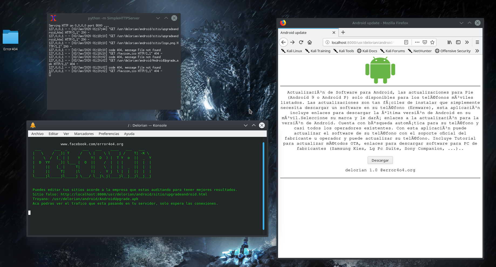

# Delorian
<h6>Descripcion</h6>
 

Deloria 1.0 , genera cargas util de MSF, servidor donde alojar nuestros sitios falsos para vulnerar a los usuarios de la empresa 
donde estamos trabajando legalmente, cualquier fin de lucrarse,vulnerar la intimidad de personas ajenas a nuestro trabajo como    pentesters o cometer delitos informaticos no nos hacemos reponsables ya que Delorian 1.0 esta creado con el unico fin de tomar conciencia o simplemente para usarlo en sesiones de pentesting dentro del marco legal.
Delorian genera cargas util de Metasploit-Framework , genera un simple servidor en Python al puerto 8000 en nuestro localhost 
con un sitio falso para vulnerar a nuestra victima con ingenieria social o un DNS Spoofing, los sitios falsos son acorde a     windows(actualizar firewall) y Android(descarga app de actualizacion) las index o sitios falsos se pueden editar, 
el banner del script muestra donde estara nuestro troyano,nuestro sitio web y el trafico de lo que va pasando en nuestro simple servidor.
para dificultarle a los ciberdelincuentes creamos delorian dentro de nuestra red LAN , para que los phishing,sitios falsos no sean 
usados con fines mal intencionados, ya pronto se vera un video de la herramienta actualizada, ya que anteriormente se grabó un video
en nuestro canal de Youtube para mostrar un adelanto, la herramienta se quedo guardada y no se terminó, las index son mal 
creadas con el fin de no vulnerar a nadie o mentir a nadie para tomar el acceso de su android o windows, pero se pueden editar para 
tener mejores resultados, lo mismo con los troyanos.

<h5>Se recomienda testear primero</h5>

<h6>Muestra:</h6>

<h6>instalacion</h6>

git clone https://github.com/error404-notfound/Delorian

cd Delorian

chmod 777 install.sh

chmod 777 script.sh

bash install.sh
 

./Delorian

<h6>Informacion:</h6>

La index de windows se guardara en la ruta: /usr/delorian/windows/sitio

La index de android se guardara en la ruta: /usr/delorian/android/sitio/

 

Las index son 100% modificables, las que trae pre editadas solamente son para muestra, ya si quisieramos algo mas serio tocaria editarlas acorde a la ingenieria social que vayamos hacer en el momento.

Troyano Windows /usr/delorian/windows/upfirewall.exe

Troyano Android /usr/delorian/android/android.apk

<h6>Visitamos en nuestra redes sociales ayudanos con tu like.</h6>
 
Visita nuestra canal de youtube
https://www.youtube.com/channel/UC9ZtujTcMuBcKsV4-4G9Zxg

Visita nuestra cuenta de Facebook
https://www.facebook.com/error4o4.org

También estamos en Twitter
https://twitter.com/error4o4org

Visita nuestra cuenta de GitHub https://github.com/error404-notfound

Cuenta PayPal para sus donativo
https://www.paypal.me/error404notjavic
